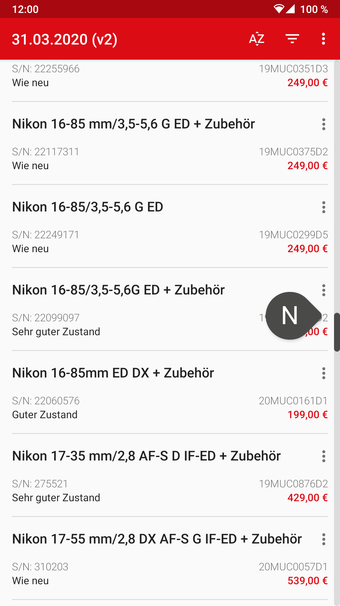

# Sauter Schnaeppchen

An experimental android app, parsing some bad-formed pdf.

* Displaying second-hand gear offerings from a local camera store.  
* Using MVVM pattern with Android architecture components
* Parsing pdf with [iText](https://itextpdf.com/de)

## Data source

Offers to be found here:  
<https://www.foto-video-sauter.de/used> -> "Entdecken Sie unsere Secondhand-Artikel"

Files up to now:

* <https://www.foto-video-sauter.de/INTERSHOP/static/BOS/Calumet-Site/SauterDE/Calumet-SauterDE/de_DE/pdf/second-hand/schnaeppchen-liste-second-hand-20200211.pdf>
* <https://www.foto-video-sauter.de/INTERSHOP/static/BOS/Calumet-Site/SauterDE/Calumet-SauterDE/de_DE/pdf/second-hand/Second%20Hand%20Liste_25.03.2020.pdf>
* <https://www.foto-video-sauter.de/INTERSHOP/static/BOS/Calumet-Site/SauterDE/Calumet-SauterDE/de_DE/pdf/second-hand/Second%20Hand%20Liste%20Stand%2031.03.2020_2.pdf>

## Screenshot

